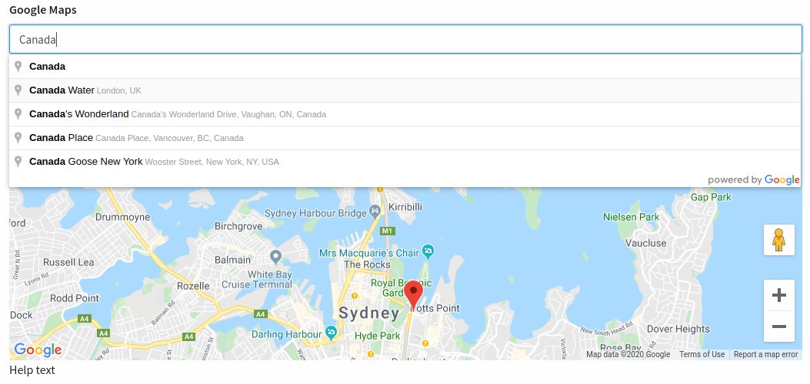

#### Custom Google Maps Input for Laravel Backpack


#### How to install

with composer:

```bash
composer require abr4xas/gmaps-input-backpack
```

#### How to use

Add your Google Api Key to the env file:

```
GOOGLE_MAPS_API_KEY=
```

Add this to your backpack controller:

```php
$this->crud->addField([
    'name'  => 'address-input', // do not change this
    'type'  => 'customGoogleMaps', // do not change this
    'label' => "Google Maps",
    'hint'  => 'Help text',
    'attributes' => [
        'class' => 'form-control map-input', // do not change this, add more classes if needed
    ],
    'view_namespace' => 'custom-google-maps-field-for-backpack::fields',
]);
```
> Notice the view_namespace attribute - make sure that is exactly as above, to tell Backpack to load the field from this addon package, instead of assuming it's inside the Backpack\CRUD package.


#### Preview:




Thanks to https://laraveldaily.com/laravel-find-addresses-with-coordinates-via-google-maps-api/ for the inspiration.